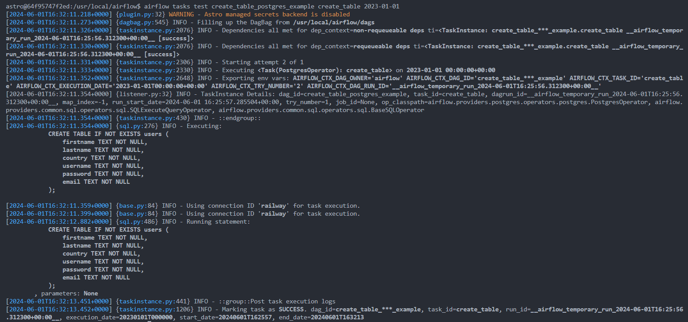

Repositório para testes de uso do Airflow
---

# Instalação

## Apache Airflow com o WSL

Este guia fornece instruções para configurar o Apache Airflow utilizando o WSL (Windows Subsystem for Linux).

## Instalar o Astro

Para instalar o Astro, execute o seguinte comando:

```sh
curl -sSL install.astronomer.io | sudo bash -s
```

## Criar Pasta para o Projeto

Crie uma nova pasta para o seu projeto:

```sh
mkdir <nome_pasta>
```

## Iniciar o Astro

Inicialize o Astro na pasta criada:

```sh
cd <nome_pasta>
astro dev init
```

## Abrir o VsCode

Abra o Visual Studio Code na pasta do projeto:

```sh
code .
```

## Configurar o Docker

    - 1. Abra o Docker.
    - 2. Vá em `Settings` > `Resources` > `WSL Integration`.
    - 3. Verifique se a opção `Ubuntu` está ativada.

## Inicializar o Ambiente no WSL

Para iniciar o ambiente, execute o seguinte comando:

```sh
astro dev start
```

## Airflow Web Service
Para acessar a interface do airflow:
http://127.0.0.1:8080/home


## Instalar o Python e dependências

Para instalar o Python e qualquer outra biblioteca, execute os seguintes comandos:

```sh
sudo apt install python3-pip
pip install pandas
pip install requests
```

# Cria uma conexão

Acesse a opção Admin/Conections no webserver http://127.0.0.1:8080/connection/list/


# Testar uma DAG

## Acesse a VM do agendador no docker:
```sh
docker exec -it tests-airflow_b52731-scheduler-1 /bin/bash
```

## Para exibir todos os comandos:
```sh
airflow dash h
```

## Testar a dag
### Prática recomendada sempre ao criar uma nova tarefa a DAG 
```sh
airflow tasks test create_table_postgres_example create_table 2022-01-01  
```


Obs.: 2022-01-01, data definada para testar a DAG.