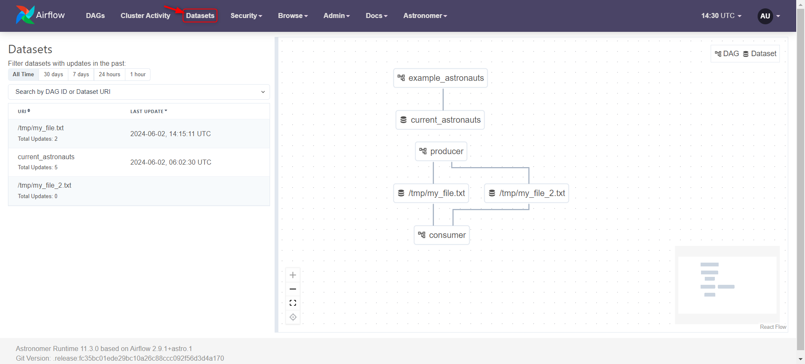

# Limitações do Conjunto de Dados

Os conjuntos de dados são uma ferramenta incrível para manipular e analisar dados dentro do contexto do Airflow. No entanto, é importante reconhecer que eles também têm suas limitações. Abaixo estão algumas das limitações mais importantes a serem consideradas:

1. **Restrição de Uso de DAGs**: Um DAG (Directed Acyclic Graph) só pode utilizar conjuntos de dados que residem na mesma instância do Airflow. Isso significa que um DAG não pode esperar por um conjunto de dados definido em outra instância do Airflow, o que pode limitar a flexibilidade em certos cenários de integração.

2. **Gatilho de Consumidor**: Os DAGs do consumidor são acionados sempre que uma tarefa que atualiza conjuntos de dados é concluída com sucesso. No entanto, o Airflow não verifica se os dados foram atualizados de maneira eficaz. Isso pode levar a situações em que os DAGs do consumidor são ativados mesmo quando os dados não foram atualizados conforme o esperado.

3. **Incompatibilidade de Agendas**: Não é possível combinar agendas diferentes, como conjuntos de dados, com expressões cron. Isso pode limitar a capacidade de agendar tarefas de maneira flexível, especialmente quando diferentes conjuntos de dados têm requisitos de atualização específicos.

4. **Concorrência de Tarefas**: Se duas tarefas atualizarem o mesmo conjunto de dados, assim que uma for concluída, isso acionará o DAG do consumidor imediatamente, sem esperar a conclusão da segunda tarefa. Isso pode levar a resultados imprevisíveis ou conflitos de dados.

5. **Monitoramento Limitado**: O Airflow monitora conjuntos de dados apenas no contexto de DAGs e tarefas. Se uma ferramenta externa atualizar os dados reais representados por um conjunto de dados, o Airflow não terá como saber disso. Isso pode levar a discrepâncias entre os dados registrados no Airflow e os dados reais armazenados em um sistema externo.

É importante estar ciente dessas limitações ao projetar e implementar fluxos de trabalho de dados no Airflow, para garantir que suas operações sejam executadas de maneira eficiente e confiável.

Para ver os Datasets utilizados em pipelines, acesse a opção no WebServer do aiflow:
